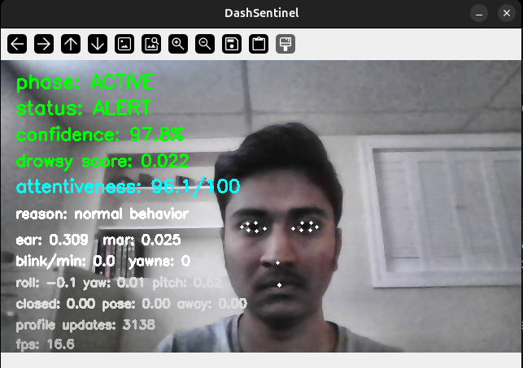
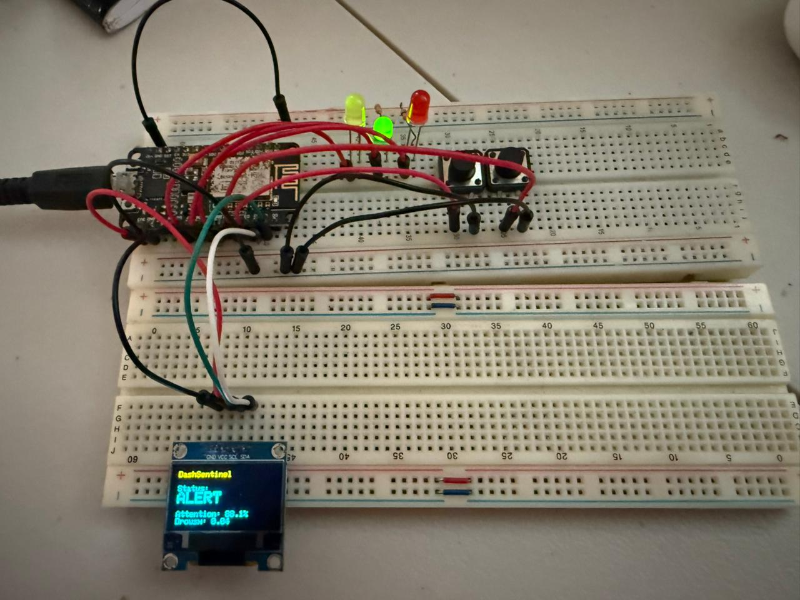

# 🚗 DashSentinel

**Real-time driver drowsiness / distraction warning prototype with an embedded feedback interface**

<table align="center">
  <tr>
    <td align="center">
      <br>
      <b>Left:</b> real-time facial tracking and attentiveness scoring
    </td>
    <td align="center">
      <br>
      <b>Right:</b> ESP8266 hardware interface
    </td>
  </tr>
</table>

## Overview

DashSentinel is a local-first driver monitoring prototype. It combines:

- OpenCV / MediaPipe FaceMesh for facial landmarks and head-pose features
- frame-quality checks for blurry, dark, overexposed, or low-contrast frames
- visibility gates for eyes and mouth so hidden landmarks do not create false drowsiness events
- multi-face selection so a passenger face does not automatically become the scored face
- optional local ONNX deep-learning fusion through OpenCV DNN
- ESP8266 telemetry for warning/status display

This project is a **warning system prototype**, not a vehicle-control or ignition-lock system. See [`docs/PRODUCT_SAFETY.md`](docs/PRODUCT_SAFETY.md).

## Current features

- Real-time face tracking and feature extraction
- Driver attentiveness scoring (%)
- Drowsiness / distraction signals based on:
  - eye closure patterns
  - yawning detection
  - head pose / looking away
  - optional local model output
  - image quality and landmark visibility
- Multi-face handling with largest/most-central driver-face selection
- Low-visibility state: `VISION DEGRADED`
- OLED display output:
  - `ALERT`
  - `WARNING`
  - `DROWSY`
  - `NO FACE`
  - `VISION DEGRADED`
- LED indicators:
  - 🟢 `ALERT` → solid green
  - 🟡 `WARNING` / `VISION DEGRADED` → blinking yellow
  - 🔴 `DROWSY` → fast blinking red
- Physical buttons:
  - reset baseline
  - reset current stats

## Why landmarks are not used alone

The scorer now gates landmarks before trusting them:

- Poor frame quality prevents high-confidence drowsiness claims.
- If eyes are not visible, EAR/blink features are ignored and the system uses head pose plus optional model output.
- If the mouth is not visible, yawning is disabled for that frame.
- Multiple detected faces are handled by selecting the most likely driver face.
- Optional local deep-learning output can be fused into the score when a model is available.

No cloud inference is used. For model setup, see [`docs/LOCAL_MODELS.md`](docs/LOCAL_MODELS.md).

## Tech stack

### Software

- Python 3
- OpenCV
- MediaPipe
- NumPy
- PySerial
- optional local ONNX model via OpenCV DNN

### Hardware

- ESP8266 (NodeMCU)
- SSD1306 OLED (I2C, 128x64)
- push buttons (x2)
- LEDs (red, yellow, green)
- resistors (3x 330 ohms)

## Project structure

```text
DashSentinel/
├── run_dashsentinel.py        # main entrypoint
├── src/
│   ├── app.py                 # main app orchestration
│   ├── cli.py                 # command-line options
│   ├── constants.py           # landmark indices
│   ├── face_selection.py      # multi-face driver-face selection
│   ├── features.py            # EAR/MAR/head-pose/visibility extraction
│   ├── local_model.py         # optional local ONNX model adapter
│   ├── logging_utils.py       # CSV event logging
│   ├── profile.py             # adaptive user baseline
│   ├── scoring.py             # scoring, gates, hysteresis
│   ├── serial_telemetry.py    # ESP8266 communication
│   └── vision_quality.py      # blur/lighting/contrast checks
├── DisplayModule/             # ESP8266 PlatformIO firmware
├── docs/                      # model and product-safety notes
├── nodemcu_carrier_pcb/       # KiCad hardware design
├── schematic/                 # schematic
├── data/                      # sample/runtime profile data
├── media/                     # screenshots/photos
├── requirements.txt
└── README.md
```

## Install

```bash
pip install -r requirements.txt
```

## Run

### UI only

```bash
python3 run_dashsentinel.py --show-ui --draw-landmarks --refine-landmarks
```

### UI + ESP8266 interface

```bash
python3 run_dashsentinel.py \
  --show-ui \
  --draw-landmarks \
  --enable-esp-serial \
  --esp-port /dev/ttyUSB0
```

### Headless mode with logging

```bash
python3 run_dashsentinel.py \
  --headless \
  --log-csv \
  --enable-esp-serial \
  --esp-port /dev/ttyUSB0
```

### Higher-resolution camera input

For unclear frames, try a better camera or a higher input resolution if your machine can keep up:

```bash
python3 run_dashsentinel.py --show-ui --width 960 --height 540 --camera-fps 30
```

### Optional local model

```bash
python3 run_dashsentinel.py \
  --show-ui \
  --max-faces 3 \
  --local-model-path ./models/dms_classifier.onnx \
  --local-model-input-size 224
```

## Calibration

At startup, DashSentinel collects a user-specific baseline from frames that pass quality and visibility checks. Baseline frames must have:

- usable frame quality
- visible eyes and mouth
- no yawn flag
- no bad posture flag
- low eye-closure duration

Reset baseline manually:

```bash
python3 run_dashsentinel.py --show-ui --mirror --rebuild-baseline-on-start
```

## Useful flags

```bash
python3 run_dashsentinel.py --help
```

Important robustness flags:

- `--max-faces 3`
- `--min-frame-brightness 35`
- `--max-frame-brightness 225`
- `--min-frame-contrast 18`
- `--min-frame-blur 45`
- `--low-quality-hold-frames 8`
- `--local-model-path ./models/dms_classifier.onnx`
- `--require-local-model`

## Safety note

DashSentinel should warn, log, and display status only. It should not disable a vehicle, block emergency use, or make enforcement/lockout decisions from computer vision alone. See [`docs/PRODUCT_SAFETY.md`](docs/PRODUCT_SAFETY.md).

## Future improvements

- train and validate a local DMS model on in-car lighting/camera conditions
- identity tracking / enrolled-driver selection over time
- camera calibration and night-driving validation
- sunglasses/mask/glare robustness tests
- more formal evaluation metrics for false positives/false negatives
- mobile app integration
- standalone embedded unit / dashcam form factor
